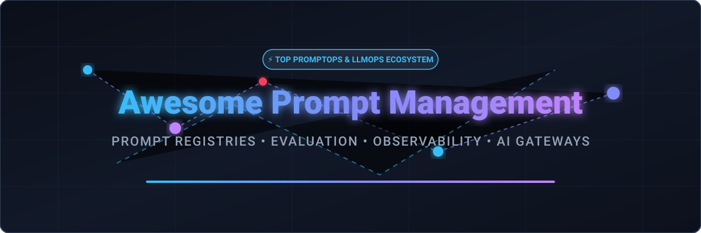

  

  
  
  
  
  
  

# 🚀 Awesome Prompt Management & PromptOps Ecosystem

> A curated list of top **SaaS platforms**, **hosted LLMOps infrastructure**, and **open-source GitHub tools** focused on **Prompt Version Control**, **Prompt Registries**, **LLM Evaluation (Eval)**, **Experimentation**, **AI Gateways**, and **Production Observability**.

Last updated: September 2026

This repository tracks notable SaaS/hosted platforms and open-source projects for **Prompt Management** and **PromptOps**. These tools help AI engineers, developers, and LLMOps teams create, version, test, compare, evaluate, deploy, monitor, and roll back prompts used in production LLM applications and autonomous AI agents.

---

## 📌 Table of Contents
- [🏢 SaaS & Hosted Platforms](#-saas--hosted-platforms)
- [🔓 Open-Source GitHub Projects](#-open-source-github-projects)
- [💡 How to Contribute](#-how-to-contribute)
- [📈 Star History](#-star-history)
- [⚠️ Disclaimer](#%EF%B8%8F-disclaimer)

---

## 🏢 SaaS & Hosted Platforms

> **Market Intelligence & Sector Overview:** The global LLMOps, Prompt Management, and AI Observability market is estimated at **~$1.8 Billion in 2025–2026** (projected to exceed **$12 Billion by 2030** with a 38% CAGR). The sector is currently **moderately-to-highly fragmented** with active consolidation through major acquisitions (e.g., OpenAI/Promptfoo, Cisco/Galileo, Palo Alto Networks/Portkey, ClickHouse/Langfuse, Dynatrace/Arize AI), alongside emerging category leaders competing across enterprise and developer segments.

Below is a curated comparison of leading commercial SaaS and hosted platforms, sorted by **Company Size / Valuation / Total Funding (Descending)**:

| Product | Description | Pricing (Starting Paid Tier) | Free Tier / Trial Limit | Company Size / Valuation / Funding |
|---|---|---|---|---|
| **[Promptfoo](https://www.promptfoo.dev)** | Developer-focused prompt testing and evaluation platform centered on automated testing, regression detection, red teaming, model comparison, and CI/CD integration. | $50/mo (Team plan) | Community plan free forever (CLI / open-source, 10,000 probes/mo limit for red teaming) | **$157 Billion** (Acquired by OpenAI) |
| **[Galileo](https://www.rungalileo.io)** | AI evaluation and observability platform focused on evaluating LLM application quality, experiments, prompt behavior, and production performance. | $100/mo (Pro plan, billed annually) | Developer Tier free forever (5,000 traces/mo, unlimited users) | **$200+ Billion** (Acquired by Cisco) |
| **[Humanloop](https://humanloop.com)** | AI product-development platform historically focused on prompt management, experimentation, evaluation, and human feedback workflows. | $150/mo (Team plan starting price) | 14-day free trial (10,000 logs/mo, 50 eval runs, 2 members) | **$18+ Billion** (Acquired by Anthropic) |
| **[Arize AI](https://arize.com)** | AI observability and evaluation platform for monitoring LLM applications, model behavior, prompt-related performance, experiments, and production quality. | $50/mo (AX Pro plan) | AX Free plan free forever (25,000 trace spans/mo, 7-day data retention) | **$14+ Billion** (Acquired by Dynatrace / $135M Raised) |
| **[Weights & Biases Weave](https://wandb.ai)** | AI application development and observability platform for tracing, evaluating, experimenting with, and monitoring LLM applications and prompts. | $60/mo (Pro plan) | Personal/Free plan free forever (personal use, 5 seats, 5 GB storage, 1 GB/mo Weave ingestion) | **$1.25 Billion Valuation** ($135M Raised) |
| **[LangSmith](https://www.langchain.com/langsmith)** | LangChain's AI engineering platform for prompt management, tracing, debugging, datasets, evaluations, experiment tracking, and production monitoring. | $39/seat/mo (Plus plan) | Developer plan free forever (1 seat, 5,000 traces/mo, 14-day data retention) | **$1.25 Billion Valuation** ($260M Total Funding) |
| **[Braintrust](https://www.braintrust.dev)** | Evaluation-first AI engineering platform combining datasets, experiments, scoring, production logging, prompt iteration, and AI application quality management. | $249/mo (Pro plan) | Starter plan free forever (1 GB data, 10,000 scores, $10 monthly model credits, 14-day retention) | **$800 Million Valuation** ($121M Total Funding) |
| **[Comet Opik Cloud](https://www.comet.com)** | Hosted LLM observability and evaluation platform supporting experiments, traces, datasets, prompt management, and production AI monitoring. | $19/mo (Pro Cloud plan) | Free Cloud plan free forever (25,000 spans/mo, 10 team members, 60-day data retention) | **~$300 Million Valuation** ($70M Total Funding) |
| **[Patronus AI](https://www.patronus.ai)** | AI evaluation and reliability platform focused on testing, benchmarking, evaluating, and monitoring generative AI applications. | Pay-as-you-go ($10 – $20 per 1,000 API calls) | Free trial with $5 sign-up bonus credits (no monthly free tier) | **~$250 Million Valuation** ($70M Total Funding) |
| **[Portkey AI](https://portkey.ai)** | AI gateway and observability platform supporting model routing, prompt management, versioning, guardrails, caching, logging, tracing, and multi-provider AI infrastructure. | $49/mo (Production plan) | Developer plan free forever (10,000 recorded logs/mo) | **$140 Million Acquisition** (Palo Alto Networks / $18M Raised) |
| **[Vellum](https://www.vellum.ai)** | AI development platform providing visual prompt engineering, version-controlled deployments, workflow design, testing, evaluations, and production experimentation. | $30/mo (Mighty plan) / $100/mo (Super plan) | Base plan free forever (1 vCPU, 2 GiB RAM, 6 GiB storage, pay-as-you-go credits) | **~$100 Million Valuation** ($25.5M Total Funding) |
| **[Langfuse Cloud](https://langfuse.com)** | Hosted AI engineering platform offering prompt management, versioning, tracing, evaluations, datasets, experiments, analytics, and production observability. | $29/mo (Core plan) | Hobby plan free forever (50,000 billable units/mo, 2 users, 30-day data retention) | **~$40 Million Valuation** (Acquired by ClickHouse / $4.5M Raised) |
| **[HoneyHive](https://www.honeyhive.ai)** | AI observability and evaluation platform supporting experimentation, tracing, evaluation workflows, and production analysis for LLM applications. | $99/mo (Growth starting price / Enterprise quote) | Developer plan free forever (10,000 events/mo, 5 users, 30-day data retention) | **~$25 Million Valuation** ($4.5M Raised) |
| **[Helicone Cloud](https://www.helicone.ai)** | Hosted LLM observability and optimization platform combining request logging, experimentation, prompt management, evaluation, cost monitoring, and analytics. | $79/mo (Pro plan) | Hobby plan free forever (10,000 requests/mo, 1 GB storage, 1 seat) | **~$15 Million Valuation** ($1.2M Raised) |
| **[Keywords AI](https://www.keywordsai.co)** | LLM application platform offering prompt management, observability, evaluations, analytics, model monitoring, and team collaboration. | $199/mo (Team plan) | Free plan free forever (10,000 logs/mo, 2 seats) | **~$15 Million Valuation** ($2M+ Raised) |
| **[PromptLayer](https://www.promptlayer.com)** | Dedicated prompt management platform providing prompt registries, version history, releases, labels, collaboration, evaluations, request logging, and production tracing. | $49/mo (Pro plan) | Free forever (2,500 requests/mo, 5 seats) | **~$12 Million Valuation** ($1.5M Raised) |
| **[Future AGI](https://www.futureagi.com)** | AI quality and observability platform supporting prompt experimentation, evaluation, optimization, tracing, and production AI monitoring. | $50/mo (Team plan) | Free plan free forever (monthly free allowances for storage, gateway & AI credits, up to 3 seats) | **~$10 Million Valuation** (Pre-Seed/Seed) |
| **[PromptHub](https://prompthub.us)** | Prompt management platform focused on centralized prompt libraries, versioning, collaboration, testing, experimentation, and controlled deployment of prompt changes. | $12/mo (Pro plan, $9/mo billed annually) | Free plan free forever (2,000 requests/mo, unlimited team members, public prompts) | **~$10 Million Valuation** (Seed) |
| **[Agenta Cloud](https://agenta.ai)** | Hosted LLMOps platform for prompt versioning, playground experimentation, prompt comparison, evaluation, deployment, and observability. | $29/mo (Pro plan) | Hobby plan free forever (5,000 agent runs/mo, 2 team members, 1-week trace retention) | **~$8 Million Valuation** (Pre-Seed/Seed) |
| **[LangWatch](https://langwatch.ai)** | LLM observability and evaluation platform supporting prompt experimentation, tracing, datasets, evaluation, and AI application monitoring. | €29/mo (~$34/mo per core seat) | Free plan free forever (200,000 events/mo, unlimited lite seats) | **~$5 Million Valuation** (Bootstrapped/Seed) |

---

## 🔓 Open-Source GitHub Projects

> Open-source prompt management, prompt engineering frameworks, evaluation tools, and AI gateways are listed below, sorted by **GitHub Star Count (Descending)**:

- **[Awesome ChatGPT Prompts](https://github.com/f/awesome-chatgpt-prompts)**  — Curated collection of ChatGPT prompt examples, personas, and prompt engineering patterns.
- **[LangChain](https://github.com/langchain-ai/langchain)**  — Leading open-source framework for building LLM applications, prompt templates, chains, and autonomous agents.
- **[vLLM](https://github.com/vllm-project/vllm)**  — High-throughput and memory-efficient LLM serving engine with prompt prefix caching and structured output decoding.
- **[Prompt Engineering Guide](https://github.com/dair-ai/Prompt-Engineering-Guide)**  — Comprehensive guide, research papers, and educational resources for prompt engineering and PromptOps.
- **[LiteLLM](https://github.com/BerriAI/litellm)**  — Open-source LLM gateway and SDK providing a unified OpenAI-compatible interface for 100+ LLMs with logging, spend tracking, and guardrails.
- **[LlamaIndex](https://github.com/run-llama/llama_index)**  — Data framework for LLM applications featuring prompt templates, structured retrieval workflows, and observability integrations.
- **[Langfuse](https://github.com/langfuse/langfuse)**  — Major open-source LLM engineering platform providing prompt management, versioning, prompt playground, tracing, datasets, and evaluations.
- **[Semantic Kernel](https://github.com/microsoft/semantic-kernel)**  — Microsoft's enterprise AI orchestration framework supporting reusable prompt functions, templates, and plugin planners.
- **[MLflow](https://github.com/mlflow/mlflow)**  — Open-source ML lifecycle platform adapted for LLM experiment tracking, prompt logging, and automated model evaluation.
- **[Promptfoo](https://github.com/promptfoo/promptfoo)**  — Open-source CLI and framework for automated LLM evaluation, prompt regression testing, red teaming, and CI/CD security scanning.
- **[Opik](https://github.com/comet-ml/opik)**  — Open-source LLM evaluation and observability platform by Comet providing tracing, datasets, experiments, and prompt management.
- **[Guidance](https://github.com/guidance-ai/guidance)**  — Guidance language for controlling, interleaving, and constraining LLM prompt generation and output structure.
- **[DSPy](https://github.com/stanfordnlp/dspy)**  — Programming framework for declarative AI systems that optimizes prompts and model weights against evaluation metrics.
- **[DeepEval](https://github.com/confident-ai/deepeval)**  — Open-source LLM evaluation framework providing unit testing for AI applications, prompts, RAG systems, and agents.
- **[Outlines](https://github.com/dottxt-ai/outlines)**  — Structured text generation framework that constrains LLM output generation using regex and Pydantic schemas.
- **[Ragas](https://github.com/explodinggradients/ragas)**  — Open-source framework for evaluating Retrieval Augmented Generation (RAG) pipelines and prompt retrieval quality.
- **[Instructor](https://github.com/instructor-ai/instructor)**  — Python framework for structured LLM output validation integrated with Pydantic for prompt workflows.
- **[Portkey AI Gateway](https://github.com/portkey-ai/gateway)**  — Open-source AI gateway for routing requests across multi-provider LLM infrastructure with caching and fallbacks.
- **[LangGPT](https://github.com/LangGPTAI/LangGPT)**  — Structured prompt design framework and reusable prompt engineering role-play patterns.
- **[Phoenix](https://github.com/arize-ai/phoenix)**  — Open-source AI observability, tracing, and evaluation platform by Arize for LLMs, RAG, and agent workflows.
- **[OpenLLMetry / Traceloop](https://github.com/traceloop/openllmetry)**  — OpenTelemetry instrumentation ecosystem for tracing LLM applications, prompts, and agent workflows.
- **[Guardrails AI](https://github.com/guardrails-ai/guardrails)**  — Open-source framework for validating and enforcing quality and safety guardrails on LLM prompt outputs.
- **[Helicone](https://github.com/helicone/helicone)**  — Open-source LLM observability platform and proxy for request logging, cost monitoring, and prompt analytics.
- **[Giskard](https://github.com/giskard-ai/giskard)**  — Open-source AI testing and evaluation platform for identifying hallucinations, security vulnerabilities, and prompt risks.
- **[OpenPrompt](https://github.com/thunlp/OpenPrompt)**  — Open-source prompt-learning framework for research and experimentation on prompt tuning and templates.
- **[Agenta](https://github.com/agenta-ai/agenta)**  — Open-source LLMOps platform for prompt playgrounds, variants, version history, evaluation, and human feedback.
- **[Latitude](https://github.com/latitude-dev/latitude-llm)**  — Open-source prompt engineering platform supporting prompt versioning, playgrounds, evaluation, and datasets.
- **[TruLens](https://github.com/truera/trulens)**  — Open-source evaluation tool for tracking LLM application quality, feedback functions, and RAG triad metrics.
- **[PromptSource](https://github.com/bigscience-workshop/promptsource)**  — Toolkit and repository for creating, sharing, and evaluating natural language prompt templates.
- **[PromptBench](https://github.com/microsoft/PromptBench)**  — Microsoft evaluation framework for benchmarking prompt robustness and adversarial attack resistance.
- **[OpenLit](https://github.com/openlit/openlit)**  — Open-source OpenTelemetry-native LLM observability platform for monitoring prompts, token usage, and costs.
- **[Inspect AI](https://github.com/UKGovernmentBEIS/inspect_ai)**  — AI Safety Institute framework for evaluating LLM agent capabilities, prompt behaviors, and tool use.

---

## 💡 How to Contribute

Contributions are warmly welcome! Please follow these simple steps to add or update entries:

1. **Fork** the repository.
2. Add or update entries in `README.md` following the existing structured format.
3. Ensure all links point to official project websites or repositories and maintain factual descriptions.
4. Submit a **Pull Request (PR)** with a brief summary of your additions.
5. Check out [Awesome-Awesome-Awesome](https://github.com/ishandutta2007/Awesome-Awesome-Awesome) for more curated lists!

---

## 📈 Star History

---

## ⚠️ Disclaimer

- This list is community-curated for informational purposes and does not constitute an endorsement.
- Category boundaries between prompt registries, LLM observability, evaluation, and AI gateways are fluid as platforms expand their features.
- Automated evaluation results are probabilistic; production workflows should pair automated metrics with appropriate human review.
- Always perform security, privacy, and enterprise compliance reviews before storing sensitive production prompts or data in third-party services.
